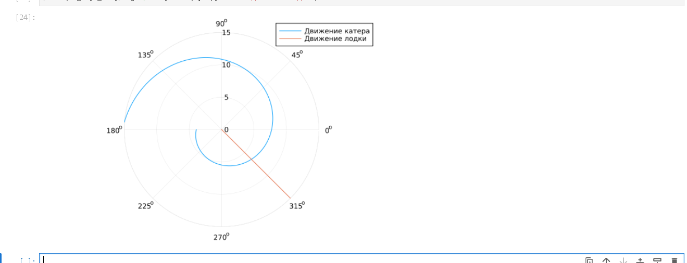
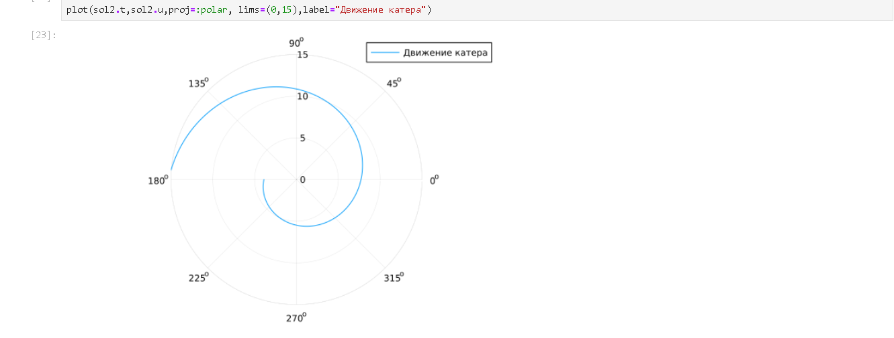
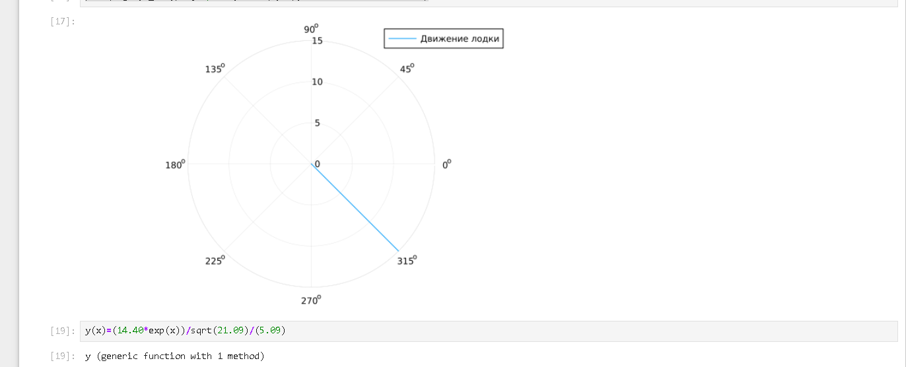

# Цель работы

Изучить математическую модель преследования браконьерской лодки катером береговой охраны.

# Задание

1. Провести вывод дифференциальных уравнений для случая, когда скорость катера больше скорости лодки в n раз.
2. Построить траектории движения катера и лодки для двух случаев.
3. Определить по графику точку пересечения.

# Теоретическое введение

$$ \frac{dr}{d\theta} = \frac{r}{\sqrt{n^2 - 1}} $$

# Выполнение лабораторной работы

## Результаты моделирования

# Анализ результатов

Точка пересечения: примерно **3.65**.

# Выводы

Модель успешно реализована.

# Задание

1. Провести вывод дифференциальных уравнений для случая, когда скорость катера больше скорости лодки в n раз.
2. Построить траектории движения катера и лодки для двух случаев.
3. Определить по графику точку пересечения.

# Теоретическое введение

$$ \frac{dr}{d\theta} = \frac{r}{\sqrt{n^2 - 1}} $$

# Выполнение лабораторной работы

## Результаты моделирования

{#fig-001 width=70%}

{#fig-001 width=70%}

{#fig-003 width=70%}

{#fig-004 width=70%}

# Анализ результатов

Точка пересечения: примерно **3.65**.

# Выводы

Модель успешно реализована.
