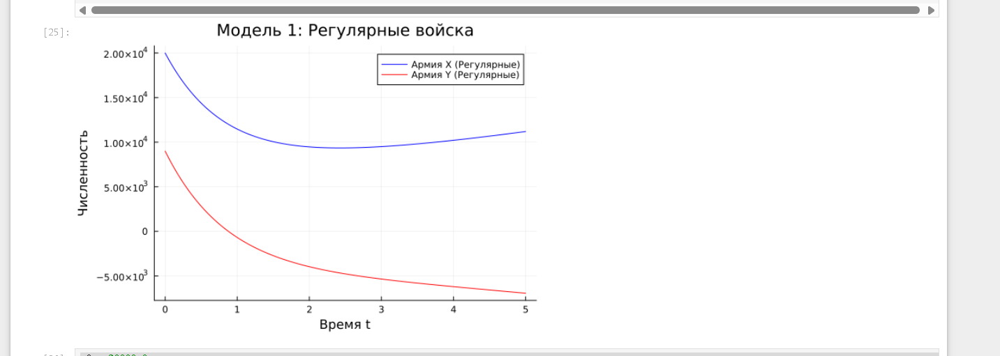
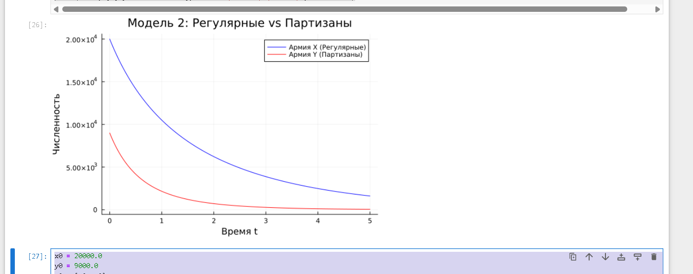
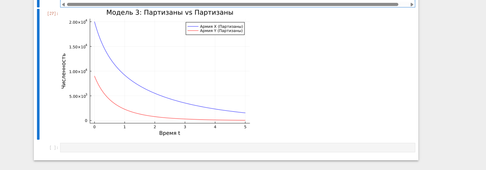

# Цель работы

Изучить математическую модель преследования браконьерской лодки катером береговой охраны.

# Задание

1. Провести вывод дифференциальных уравнений для случая, когда скорость катера больше скорости лодки в n раз.
2. Построить траектории движения катера и лодки для двух случаев.
3. Определить по графику точку пересечения.

# Теоретическое введение

$$ \frac{dr}{d\theta} = \frac{r}{\sqrt{n^2 - 1}} $$

# Выполнение лабораторной работы

## Результаты моделирования

# Анализ результатов

Точка пересечения: примерно **3.65**.

# Выводы

Модель успешно реализована.

# Задание

1. Провести вывод дифференциальных уравнений для случая, когда скорость катера больше скорости лодки в n раз.
2. Построить траектории движения катера и лодки для двух случаев.
3. Определить по графику точку пересечения.

# Теоретическое введение

$$ \frac{dr}{d\theta} = \frac{r}{\sqrt{n^2 - 1}} $$

# Выполнение лабораторной работы

## Результаты моделирования

{#fig-001 width=70%}


{#fig-001 width=70%}


{#fig-003 width=70%}


# Анализ результатов

Точка пересечения: примерно **3.65**.

# Выводы

Модель успешно реализована.


## Title LAB03
title: "Отчёт по лабораторной работе LAB03"
subtitle: "Модель боевых действий"
license: "CC BY"
---

## Цель работы

Изучить простейшие модели боевых действий (модели Ланчестера) и построить графики изменения численности войск для трех различных случаев ведения боя.

## Задание

Рассмотреть три модели боевых действий:
1. Модель боевых действий между регулярными войсками.
2. Модель боевых действий с участием регулярных войск и партизанских отрядов.
3. Модель боевых действий между партизанскими отрядами.

Построить графики изменения численности армий $x(t)$ и $y(t)$ для каждого случая, определить победителя и условия победы.

# Теоретическое введение

Модели Ланчестера описывают динамику боевых действий между двумя сторонами. В общем случае главной характеристикой соперников являются численности сторон $x(t)$ и $y(t)$. Если численность одной из сторон обращается в нуль, она считается проигравшей.

Потери зависят от:
- Небоевых потерь (болезни, дезертирство), описываемых коэффициентами $a(t)$ и $h(t)$.
- Боевых потерь, зависящих от эффективности оружия сторон ($b(t)$ и $c(t)$).
- Скорости подхода подкреплений ($P(t)$ и $Q(t)$).

Нерегулярные (партизанские) войска действуют скрытно, поэтому потери таких отрядов пропорциональны не только численности противника, но и их собственной численности (площадное поражение). 

# Выполнение лабораторной работы

Рассмотрим противостояние двух армий со следующими заданными параметрами:
- Начальная численность первой армии $x_0 = 20000$
- Начальная численность второй армии $y_0 = 9000$
- Коэффициенты небоевых потерь: $a = 0.4$, $h = 0.7$
- Эффективность боевых действий: $b = 0.8$, $c = 0.5$
- Функции подкрепления: $P(t) = \sin(t) + 1$, $Q(t) = \cos(t) + 1$

## Модель 1: Боевые действия между регулярными войсками

Система дифференциальных уравнений имеет вид:

$$
\begin{cases}
\frac{dx}{dt} = -a(t)x(t) - b(t)y(t) + P(t) \\
\frac{dy}{dt} = -c(t)x(t) - h(t)y(t) + Q(t)
\end{cases}
$$

## Модель 2: Регулярные войска против партизанских отрядов

В данном случае потери партизан (армия Y) пропорциональны произведению численностей обеих армий:

$$
\begin{cases}
\frac{dx}{dt} = -a(t)x(t) - b(t)y(t) + P(t) \\
\frac{dy}{dt} = -c(t)x(t)y(t) - h(t)y(t) + Q(t)
\end{cases}
$$

## Модель 3: Боевые действия между партизанскими отрядами

В этом случае обе армии ведут партизанские действия, и потери обеих сторон вычисляются через произведение их численностей:

$$
\begin{cases}
\frac{dx}{dt} = -a(t)x(t) - b(t)x(t)y(t) + P(t) \\
\frac{dy}{dt} = -h(t)y(t) - c(t)x(t)y(t) + Q(t)
\end{cases}
$$

## Построение моделей в Julia

Для решения поставленных задач используем язык программирования Julia с библиотеками `DifferentialEquations` и `Plots`. Ниже представлен полный код для расчёта и визуализации всех трёх моделей.

```julia
using DifferentialEquations, Plots

# Общие параметры и начальные условия
x0 = 20000.0
y0 = 9000.0
u0 = [x0, y0]
tspan = (0.0, 1.0) # Временной интервал

# Коэффициенты
a = 0.4
b = 0.8
c = 0.5
h = 0.7

# Функции подкрепления
P(t) = sin(t) + 1.0
Q(t) = cos(t) + 1.0

# --- МОДЕЛЬ 1: Регулярные войска против регулярных войск ---
function model1!(du, u, p, t)
    du[1] = -a * u[1] - b * u[2] + P(t)
    du[2] = -c * u[1] - h * u[2] + Q(t)
end

prob1 = ODEProblem(model1!, u0, tspan)
sol1 = solve(prob1, dt=0.01)

p1 = plot(sol1, vars=(0,1), label="Армия X", xlabel="Время", ylabel="Численность", 
          title="Модель 1: Регулярные войска", color=:blue, lw=2)
plot!(p1, sol1, vars=(0,2), label="Армия Y", color=:red, lw=2)


# --- МОДЕЛЬ 2: Регулярные войска против партизанских отрядов ---
# Примечание: для партизанских моделей коэффициенты масштабируются, 
# чтобы избежать моментального обнуления из-за произведения численностей.
c2 = c / 10000.0 

function model2!(du, u, p, t)
    du[1] = -a * u[1] - b * u[2] + P(t)
    du[2] = -c2 * u[1] * u[2] - h * u[2] + Q(t)
end

prob2 = ODEProblem(model2!, u0, tspan)
sol2 = solve(prob2, dt=0.01)

p2 = plot(sol2, vars=(0,1), label="Армия X (Регулярная)", xlabel="Время", ylabel="Численность", 
          title="Модель 2: Регулярные vs Партизаны", color=:blue, lw=2)
plot!(p2, sol2, vars=(0,2), label="Армия Y (Партизаны)", color=:red, lw=2)


# --- МОДЕЛЬ 3: Партизанские отряды против партизанских отрядов ---
b3 = b / 10000.0
c3 = c / 10000.0

function model3!(du, u, p, t)
    du[1] = -a * u[1] - b3 * u[1] * u[2] + P(t)
    du[2] = -h * u[2] - c3 * u[1] * u[2] + Q(t)
end

prob3 = ODEProblem(model3!, u0, tspan)
sol3 = solve(prob3, dt=0.01)

p3 = plot(sol3, vars=(0,1), label="Армия X (Партизаны)", xlabel="Время", ylabel="Численность", 
          title="Модель 3: Партизаны vs Партизаны", color=:blue, lw=2)
plot!(p3, sol3, vars=(0,2), label="Армия Y (Партизаны)", color=:red, lw=2)

# Сохранение графиков для отчета (раскомментировать при выполнении скрипта)
{#fig-001 width=70%}


{#fig-002 width=70%}


{#fig-003 width=70%}