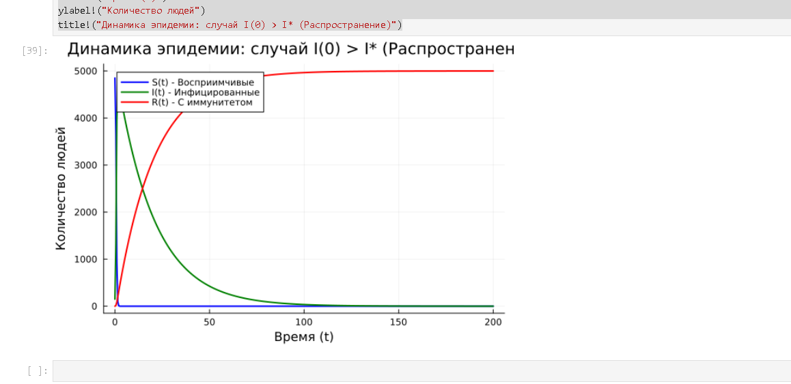
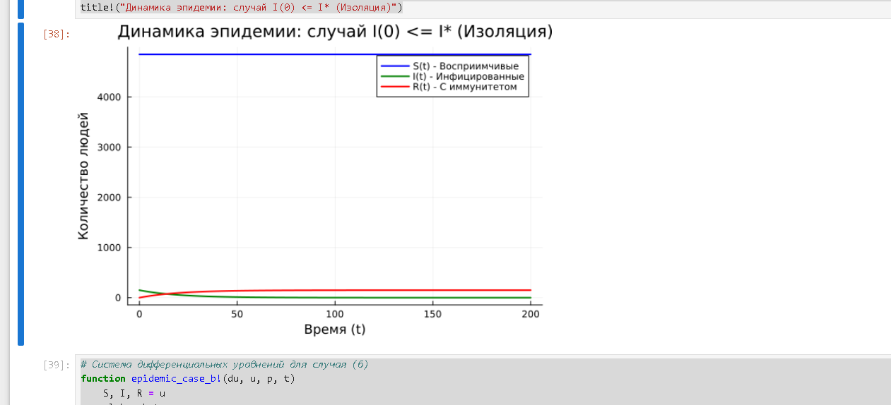

---
## Author
author:
  name: Mehmet Efe Kantoz
  no: 1032228428
  email: 1032228428@pfur.ru
  affiliation:
    - name: Российский университет дружбы народов
      country: Российская Федерация
      postal-code: 117198
      city: Москва
      address: ул. Миклухо-Маклая, д. 6
## Title
title: Структура научной презентации
subtitle: Простейший вариант
license: CC BY
date: today
date-format: "30.08.2026" # 
---
## Цель работы

Изучить простейшую жесткую модель взаимодействия двух видов «хищник — жертва» (модель Лотки-Вольтерры), определить стационарное состояние системы, а также построить графики изменения численности популяций во времени и фазовый портрет системы с помощью программных средств.

## Задание

1. Построить графики функций $x(t)$ и $y(t)$ (изменение численности волков и зайцев во времени).
2. Построить график зависимости численности хищников от численности жертв (фазовый портрет системы).
3. Найти стационарное состояние системы.

# Теоретическое введение

Простейшая модель взаимодействия двух видов «хищник — жертва» основывается на системе дифференциальных уравнений Лотки-Вольтерры:

$$
\begin{cases}
\dfrac{dx}{dt} = -ax + bxy \\
\dfrac{dy}{dt} = cy - dxy
\end{cases}
$$

где:
- $x$ — численность популяции хищников (волков);
- $y$ — численность популяции жертв (зайцев);
- $a$ — коэффициент естественной смертности хищников;
- $b$ — коэффициент прироста популяции хищников за счет взаимодействия;
- $c$ — коэффициент естественного прироста жертв;
- $d$ — коэффициент смертности жертв при взаимодействии с хищниками.

Стационарное состояние системы (положение равновесия) вычисляется по формулам:
$$
x_0 = \frac{c}{d}, \quad y_0 = \frac{a}{b}
$$

# Выполнение лабораторной работы

Зададим параметры модели:
- $a = 0.2$ (смертность хищников)
- $b = 0.5$ (прирост хищников)
- $c = 0.05$ (прирост жертв)
- $d = 0.02$ (смертность жертв)
- Начальные условия: $x(0) = 5$ (хищники), $y(0) = 10$ (жертвы)
- Интервал времени: $t \in [0, 400]$

## Расчет стационарного состояния
Подставим числовые значения параметров для нахождения точки равновесия $A(x_0, y_0)$:
- $x_0 = \frac{c}{d} = \frac{0.05}{0.02} = 2.5$
- $y_0 = \frac{a}{b} = \frac{0.2}{0.5} = 0.4$

## Программная реализация в Julia

Весь код моделирования и построения графиков объединен в единый исполняемый блок.

```julia
using DifferentialEquations
using Plots

# --- ПАРАМЕТРЫ МОДЕЛИ ---
a = 0.2  # Коэффициент смертности хищников
b = 0.5  # Коэффициент прироста хищников
c = 0.05 # Коэффициент прироста жертв
d = 0.02 # Коэффициент смертности жертв

# --- НАЧАЛЬНЫЕ УСЛОВИЯ И ИНТЕРВАЛ ---
u0 = [5.0, 10.0]     # [хищники (x), жертвы (y)]
tspan = (0.0, 400.0)

# --- СИСТЕМА УРАВНЕНИЙ ЛОТКИ-ВОЛЬТЕРРЫ ---
function lotka_volterra!(du, u, p, t)
    x, y = u
    du[1] = -a * x + b * x * y   # Хищники
    du[2] = c * y - d * x * y    # Жертвы
end

prob = ODEProblem(lotka_volterra!, u0, tspan)
sol = solve(prob, saveat=0.1)

# --- ПОСТРОЕНИЕ ГРАФИКОВ ---
# 1. График изменения численности во времени
p_time = plot(sol, label=["Хищники (x)" "Жертвы (y)"], 
              xlabel="Время t", ylabel="Численность",
              title="Динамика популяций во времени", lw=1.5)

# 2. Фазовый портрет (зависимость хищников от жертв)
p_phase = plot(sol, vars=(2, 1), label="Фазовая траектория", 
               xlabel="Жертвы (y)", ylabel="Хищники (x)",
               title="Фазовый портрет системы", color=:blue, lw=1.5)

# Объединение графиков в сетку
plot(p_time, p_phase, layout=(1, 2), size=(1100, 500))

# --- РАСЧЕТ СТАЦИОНАРНОГО СОСТОЯНИЯ ---
x_stat = c / d
y_stat = a / b
println("Стационарное состояние: x_0 = $x_stat, y_0 =$y_stat")

# --- СОХРАНЕНИЕ ГРАФИКОВДЛЯ ОТЧЕТА ---
  grafik 1([рис. @fig-001])
{#fig-001 width=70%}

  grafik 2([рис. @fig-002])
{#fig-002 width=70%}

  grafik 3([рис. @fig-003])
{#fig-003 width=70%}

  grafik 4([рис. @fig-004])
{#fig-004 width=70%}

  grafik 5([рис. @fig-005])
{#fig-005 width=70%}


Результаты моделированияГрафик изменения численности популяций хищников и жертв во времени демонстрирует периодические колебания с противофазой.

Фазовый портрет представляет собой замкнутую кривую, соответствующую периодическому режиму вокруг стационарной точки $(2.5, 0.4)$.

Выводы
В ходе выполнения лабораторной работы была изучена модель Лотки-Вольтерры «хищник-жертва». Были рассчитаны стационарные точки системы, а также построены графики динамики численности популяций во времени и фазовый портрет, наглядно демонстрирующий циклической характер взаимодействия видов.

Список литературы{.unnumbered}
::: {#refs}
:::