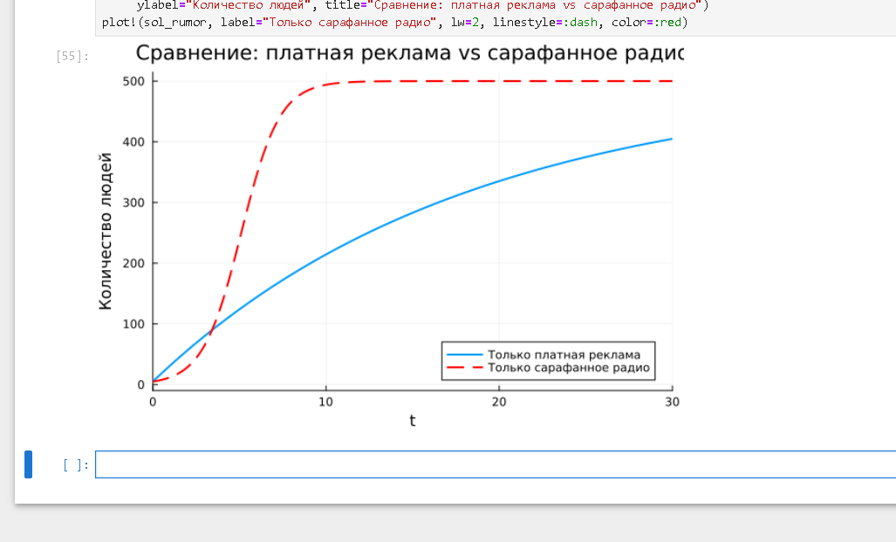
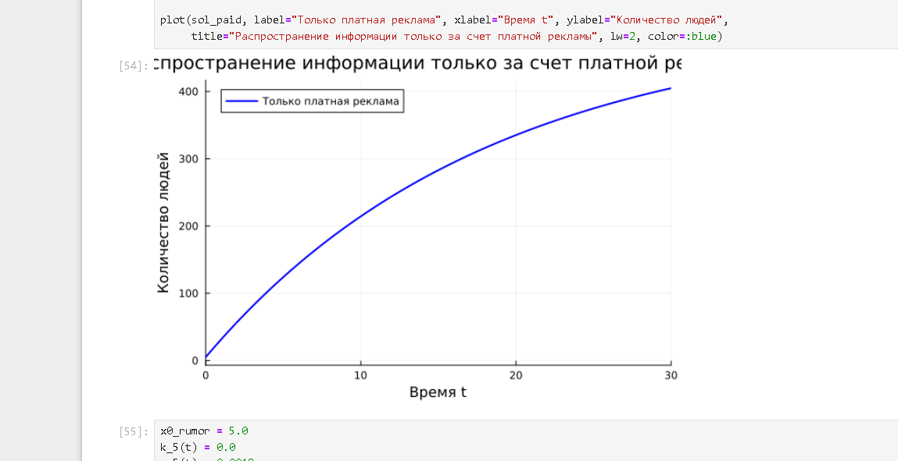
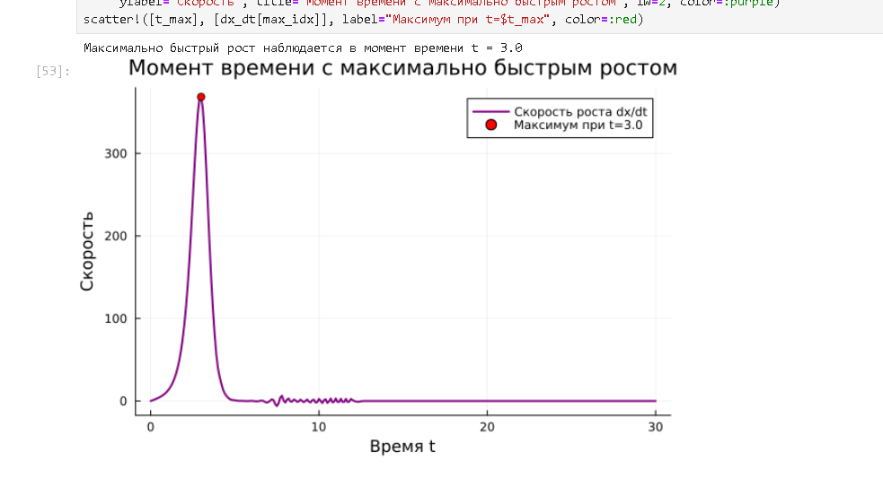
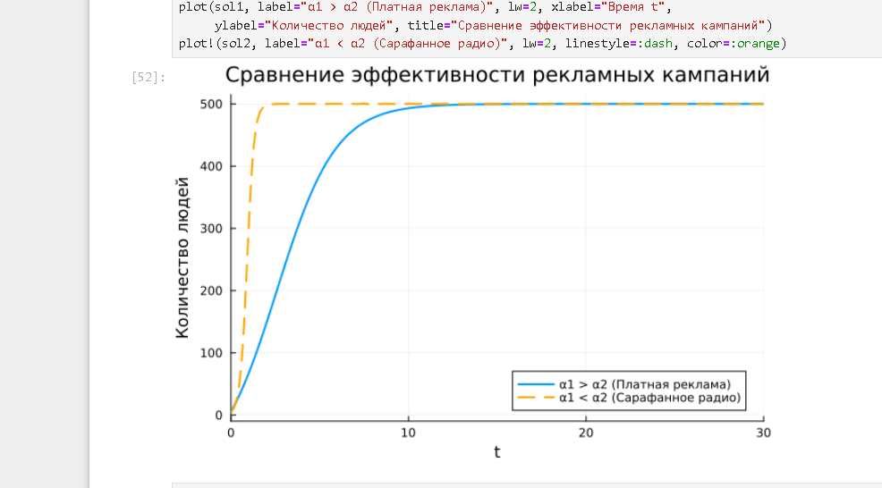
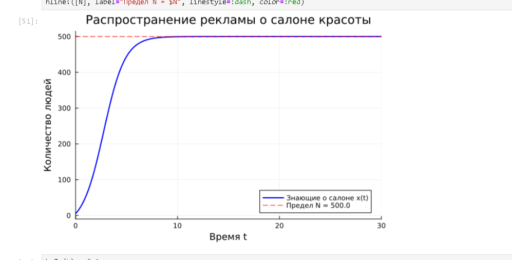

---
## Author
author:
  name: Mehmet Efe Kantoz
  no: 1032228428
  email: 1032228428@pfur.ru
  affiliation:
    - name: Российский университет дружбы народов
      country: Российская Федерация
      postal-code: 117198
      city: Москва
      address: ул. Миклухо-Маклая, д. 6
## Title
title: Структура научной презентации
subtitle: Простейший вариант
license: CC BY
date: today
date-format: "30.08.2026" # 
---

# --- ОТВЕТЫ НА ВОПРОСЫ К ЛАБОРАТОРНОЙ РАБОТЕ ---
# 1. Модель Мальтуса: dx/dt = kx. Используется для экспоненциального роста 
#    или убывания процессов в условиях неограниченных ресурсов.
# 2. Уравнение логистической кривой: dx/dt = kx(N - x). Описывает процессы роста, 
#    которые по мере приближения к емкости среды N замедляют свой рост.
# 3. Влияние коэффициентов α1(t) и α2(t): α1(t) задает интенсивность платной 
#    рекламы, а α2(t) определяет скорость распространения сарафанного радио.
# 4. При α1(t) >> α2(t): доминирует внешняя платная реклама.
# 5. При α1(t) << α2(t): доминирует сарафанное радио (лавинообразный процесс).

using DifferentialEquations
using Plots

println("\nМоделирование завершено успешно!")

# Параметры и начальные условия
N = 5000.0
I0 = 150.0
R0 = 0.0
S0 = N - I0 - R0

a = 0.001  # коэффициент заболеваемости (alpha)
b = 0.05   # коэффициент выздоровления (beta)

u0 = [S0, I0, R0]
tspan = (0.0, 200.0)
p = (a, b)

# Система дифференциальных уравнений для случая (a)
function epidemic_case_a!(du, u, p, t)
    S, I, R = u
    alpha, beta = p
    du[1] = 0.0           # dS/dt
    du[2] = -beta * I     # dI/dt
    du[3] = beta * I      # dR/dt
end

prob_a = ODEProblem(epidemic_case_a!, u0, tspan, p)
sol_a = solve(prob_a, Tsit5(), saveat=0.5)

# Построение графиков
plot(sol_a.t, [u[1] for u in sol_a.u], label="S(t) - Восприимчивые", color=:blue, linewidth=2)
plot!(sol_a.t, [u[2] for u in sol_a.u], label="I(t) - Инфицированные", color=:green, linewidth=2)
plot!(sol_a.t, [u[3] for u in sol_a.u], label="R(t) - С иммунитетом", color=:red, linewidth=2)

xlabel!("Время (t)")
ylabel!("Количество людей")
title!("Динамика эпидемии: случай I(0) <= I* (Изоляция)")

# Система дифференциальных уравнений для случая (б)
function epidemic_case_b!(du, u, p, t)
    S, I, R = u
    alpha, beta = p
    du[1] = -alpha * S * I              # dS/dt
    du[2] = alpha * S * I - beta * I    # dI/dt
    du[3] = beta * I                    # dR/dt
end

prob_b = ODEProblem(epidemic_case_b!, u0, tspan, p)
sol_b = solve(prob_b, Tsit5(), saveat=0.5)

# Построение графиков
plot(sol_b.t, [u[1] for u in sol_b.u], label="S(t) - Восприимчивые", color=:blue, linewidth=2)
plot!(sol_b.t, [u[2] for u in sol_b.u], label="I(t) - Инфицированные", color=:green, linewidth=2)
plot!(sol_b.t, [u[3] for u in sol_b.u], label="R(t) - С иммунитетом", color=:red, linewidth=2)

xlabel!("Время (t)")
ylabel!("Количество людей")
title!("Динамика эпидемии: случай I(0) > I* (Распространение)")

# --- СОХРАНЕНИЕ ГРАФИКОВДЛЯ ОТЧЕТА ---
  grafik 1([рис. @fig-001])
{#fig-001 width=70%}
  grafik 2([рис. @fig-002])
{#fig-002 width=70%}
  grafik 3([рис. @fig-003])
{#fig-003 width=70%}
  grafik 4([рис. @fig-004])
{#fig-004 width=70%}
  grafik 5([рис. @fig-005])
{#fig-005 width=70%}

Выводы
В ходе выполнения лабораторной работы была изучена математическая модель распространения рекламы,
 учитывающая как внешние маркетинговые инвестиции (платную рекламу),
  так и внутренние коммуникативные процессы («сарафанное радио»).
   С помощью программной реализации в среде Julia были построены графики динамики охвата аудитории для различных режимов работы коэффициентов интенсивности,
    определены моменты максимальной скорости роста информированности рынка,
    а также сопоставлены сценарии с раздельным и совместным действием рекламных факторов.

Список литературы{.unnumbered}
::: {#refs}
:::