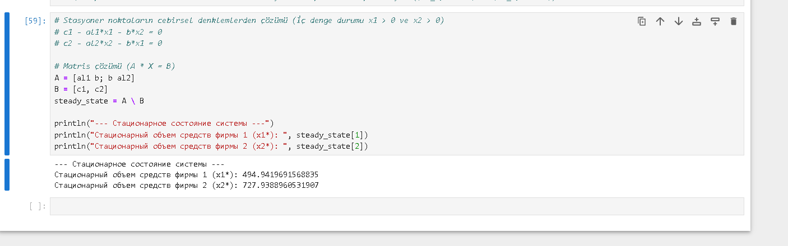
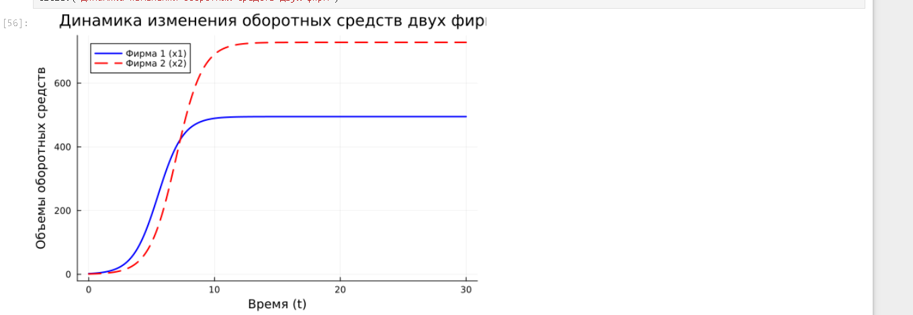

## Цель работы

* Изучить модель линейного гармонического осциллятора.
* Освоить алгоритм перехода от дифференциального уравнения второго порядка к системе двух уравнений первого порядка.
* Построить решения и фазовые портреты гармонических колебаний для трех различных случаев (без затухания, с затуханием, под действием внешней силы).

## Теоретическое введение

* Уравнение гармонического осциллятора:
  $$\ddot{x} + 2\gamma\dot{x} + \omega_0^2 x = f(t)$$
* Переход к системе первого порядка ($y = \dot{x}$):
  $$\begin{cases}
  \frac{dx}{dt} = y \\
  \frac{dy}{dt} = -2\gamma y - \omega_0^2 x + f(t)
  \end{cases}$$

## Инициализация параметров в Julia

```julia
using DifferentialEquations
using Plots

w0_sq = 3.5
gamma = 0.5
u0 = [1.0, -0.5]
tspan = (0.0, 50.0)


#Моделирование: Без затухания и с затуханием

# Модель 1: Без затухания
function model1!(du, u, p, t)
    du[1] = u[2]
    du[2] = -w0_sq * u[1]
end
sol1 = solve(ODEProblem(model1!, u0, tspan), saveat=0.05)

# Модель 2: С затуханием
function model2!(du, u, p, t)
    du[1] = u[2]
    du[2] = -2 * gamma * u[2] - w0_sq * u[1]
end
sol2 = solve(ODEProblem(model2!, u0, tspan), saveat=0.05)

#Моделирование: Внешняя сила

# Модель 3: С внешней силой
f(t) = 0.7 * sin(2.0 * t)
function model3!(du, u, p, t)
    du[1] = u[2]
    du[2] = -2 * gamma * u[2] - w0_sq * u[1] + f(t)
end
sol3 = solve(ODEProblem(model3!, u0, tspan), saveat=0.05)


# --- СОХРАНЕНИЕ ГРАФИКОВДЛЯ ОТЧЕТА ---
  grafik 1([рис. @fig-001])
{#fig-001 width=70%}


  grafik 2([рис. @fig-002])
{#fig-002 width=70%}


#Выводы

Сведение порядка: Успешно реализован переход от уравнения 2-го порядка к системе двух уравнений 1-го порядка.

Без затухания: Энергия сохраняется, фазовый портрет — замкнутые кривые (эллипсы).

С затуханием: Амплитуда убывает, фазовый портрет — спираль к началу координат.

С внешней силой: Система переходит в режим установившихся вынужденных колебаний (предельный цикл).